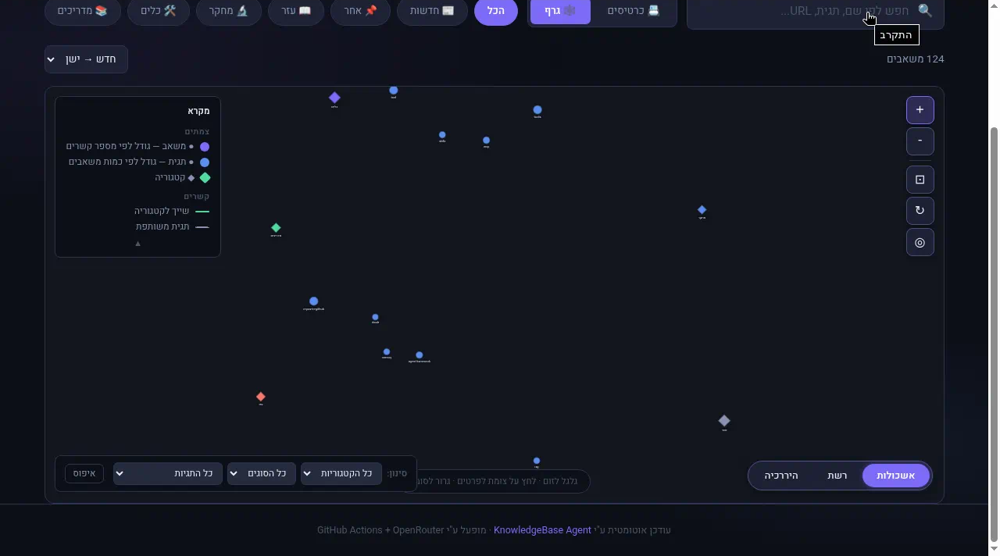

# KnowledgeBase Agent

A personal technical-link knowledge base for AI resources — tools, research papers, tutorials, news, and references — synced automatically from a Google Sheet.

**Live site:** <https://amitro123.github.io/knowledgeBase-Agent/>

## Graph View

The site includes an interactive graph that shows how resources, tags, and categories relate to each other. Switch between Clusters, Network, and Hierarchy modes.



## How It Works

```
Google Sheet (source of truth)
  ↓  GitHub Action (every 30 min / manual trigger)
  ↓  scripts/sync_sheets.py
  ↓
data/resources.json
  ↓
index.html (GitHub Pages) — search, filter, cards & graph
```

1. **Edit the Google Sheet** — add or update rows in any tab (each tab becomes a tag).
2. **GitHub Action** runs every 30 minutes (or manually from the Actions tab) and syncs everything to `data/resources.json`.
3. **GitHub Pages** renders the data automatically — no build step needed.

## Sheet Structure

| Column           | JSON Field           | Description               |
| ---------------- | -------------------- | ------------------------- |
| Date             | `created` / `added_at` | Date added              |
| Link             | `url`                | Link to the resource      |
| Name/Author      | `title`              | Resource name or author   |
| Function/Summary | `summary`            | Short description         |
| Category         | `category`           | tool, tutorial, reference, news, etc. |
| Review/Notes     | `notes`              | Detailed notes            |

The tab name (e.g. "RAG", "MCP", "Security") becomes a tag on every resource in that tab.

## Project Layout

```
├── .github/workflows/
│   └── sync-sheets.yml            ← GitHub Action (Sheet → JSON)
├── data/resources.json            ← Auto-managed data file
├── scripts/
│   ├── sync_sheets.py             ← Sync script (Sheet → JSON)
│   ├── requirements-sheets.txt    ← Python dependencies for sync
│   ├── test_sync_sheets.py        ← Unit tests for field mapping
│   ├── mcp_server.py              ← Read-only MCP server (optional)
│   ├── requirements-mcp.txt       ← Dependencies for MCP server
│   ├── test_mcp_server.py         ← MCP server tests
│   ├── capture.py                 ← (legacy) Obsidian enrichment script
│   └── requirements.txt           ← (legacy) Dependencies for capture.py
├── inbox/_TEMPLATE.md             ← (legacy) Hermes note template
└── index.html                     ← Front-end (GitHub Pages)
```

## MCP Server

A read-only MCP server (`scripts/mcp_server.py`) exposes `data/resources.json` as tools for Claude / Cursor:

- `query_kb(question)` — keyword-search resources
- `get_resource(resource_id)` — fetch one resource by ID
- `search_tags(question)` — search the tag index
- `get_tag(tag)` — list resources carrying a given tag

The server never writes data. Run it via stdio or set `MCP_TRANSPORT=streamable-http` for HTTP.

## Setup — Sync Configuration

### 1. Create a Google Cloud Service Account

1. Go to [Google Cloud Console](https://console.cloud.google.com/).
2. Create a new project (or use an existing one).
3. Enable the **Google Sheets API** (APIs & Services → Enable APIs).
4. Create a Service Account (IAM & Admin → Service Accounts → Create).
5. Create a JSON key (Keys → Add Key → JSON) and download it.

### 2. Share the Sheet with the Service Account

Open the [spreadsheet](https://docs.google.com/spreadsheets/d/1wWktmD3QEHIlV9ct_NH_i0UQ5ceyxMrMTTidihBmoSU/edit)
and share it with the Service Account email (e.g.
`my-sa@my-project.iam.gserviceaccount.com`) — **Viewer** access is enough.

### 3. Add the Secret to GitHub

1. In the repo → Settings → Secrets and variables → Actions → New repository secret.
2. Name: `GOOGLE_SERVICE_ACCOUNT_JSON`
3. Value: paste the **entire contents** of the Service Account JSON key file.

### 4. Manual Run (Optional)

In the Actions tab → "Sync Google Sheets → resources.json" → Run workflow.

## Local Development

```bash
export GOOGLE_SERVICE_ACCOUNT_JSON='{ ... }'
pip install -r scripts/requirements-sheets.txt
python scripts/sync_sheets.py
```

## Tests

```bash
pip install pytest
pytest scripts/test_sync_sheets.py -v
```

## Required Secrets

| Secret                         | Description                                        |
| ------------------------------ | -------------------------------------------------- |
| `GOOGLE_SERVICE_ACCOUNT_JSON`  | Service Account JSON key for reading the spreadsheet |

## GitHub Pages

The front-end is available at: <https://amitro123.github.io/knowledgeBase-Agent/>

---

<details>
<summary>Legacy: Hermes / Obsidian capture path</summary>

The original flow used Obsidian/Hermes to write markdown notes into
`inbox/`, then `scripts/capture.py` enriched them with Claude (via
OpenRouter) and appended to `data/resources.json`.

This path is still present in the repo (`scripts/capture.py`,
`scripts/requirements.txt`, `inbox/_TEMPLATE.md`) but is no longer the
primary data source. Google Sheets is now the source of truth.

### Legacy Secrets (only needed for Obsidian capture)

| Secret              | Description                                      |
| ------------------- | ------------------------------------------------ |
| `OPENROUTER_API_KEY`| OpenRouter API key                               |
| `VAULT_READ_TOKEN`  | GitHub PAT for reading from obsidian-vault (private) |

</details>
