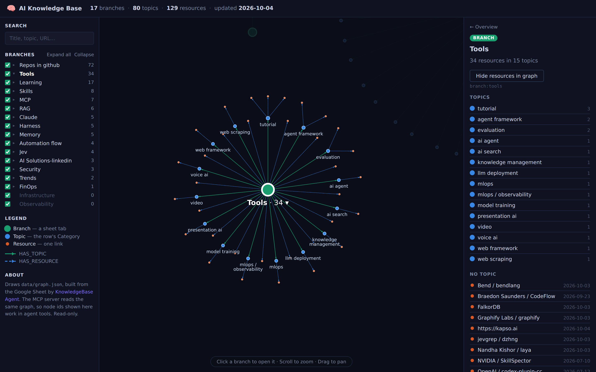
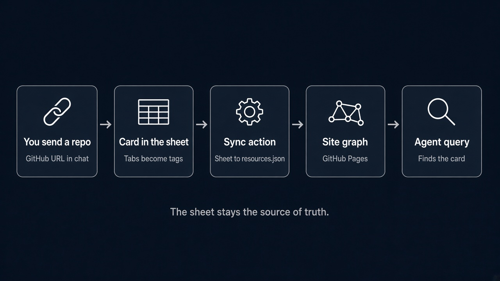

# KnowledgeBase Agent

A personal technical-link knowledge base for AI resources — tools, research papers, tutorials, news, and references — synced automatically from a Google Sheet.

## Project status

This is a personal knowledge-base project and a portfolio/reference implementation.

It is publicly viewable for learning and reference purposes.
It is not a hosted product and does not include guaranteed support,
production deployment guidance, or a commercial-use license.

## Graph View

The site draws the knowledge base as a graph of **branches**, **topics** and **resources**:

- **Branch** (green hub) — one per sheet tab, e.g. "Repos in github", "Tools", "RAG".
- **Topic** (blue) — the row's Category text, inside its branch, e.g. Tools › agent framework.
- **Resource** (orange) — one link.

Each branch is its own cluster: topics ring the hub and their resources fan out around them. The overview shows branches and topics; click a branch to open its resources. A resource that sits on several tabs appears in each of those branches. Search, a **GitHub repos only** filter, per-branch visibility and "Expand all" are in the left sidebar; the right panel lists the selected node's contents and its id (the same id the MCP tools use).


Opening a branch (here **Tools**) fans out its topics and their links; the right panel lists the branch's contents:



## End-to-End Flow



You share a GitHub URL, and a card is added to the Google Sheet (each tab becomes a branch). A GitHub Action syncs the sheet to `data/resources.json` and `data/graph.json`, GitHub Pages renders the graph, and the read-only MCP server lets an agent walk the same graph. The sheet stays the source of truth.

## How It Works

```
Google Sheet (source of truth)
  ↓  GitHub Action (every 30 min / manual trigger)
  ↓  scripts/sync_sheets.py
  ↓
data/resources.json  — one entry per URL, with its (tab, Category) placements
  ↓  scripts/build_graph.py
data/graph.json      — branch → topic → resource graph
  ↓                         ↓
index.html (Pages)        scripts/mcp_server.py (agent tools)
```

1. **Edit the Google Sheet** — add or update rows in any tab (each tab becomes a branch, the Category column its topic).
2. **GitHub Action** runs every 30 minutes, on manual trigger, and right after the sync/graph code changes on `main`, and writes `data/resources.json` and `data/graph.json`.
3. **GitHub Pages** renders the data automatically — no build step needed.

### Graph model (`data/graph.json`)

| Node | id | Comes from |
| --- | --- | --- |
| Branch | `branch:<tab-slug>` | a sheet tab (empty tabs included) |
| Topic | `topic:<tab-slug>/<topic-slug>` | the Category text of rows in that tab |
| Resource | `resource:<id>` | a URL (deduplicated across tabs); `github_repo` = `owner/repo` when the link is a GitHub project |

Edges: `HAS_TOPIC` (branch → topic), `HAS_RESOURCE` (topic → resource, or branch → resource for rows without a Category). Topics are scoped to their branch on purpose: generic values like "tool" appear on many tabs, and merging them would tie every branch to every other. Whether a resource is a GitHub project comes from its URL, not from the "Repos in github" tab, so the GitHub filter and `list_github_repos` cover repos filed on any tab. Rebuild offline with `python scripts/build_graph.py`.

## Sheet Structure

| Column           | JSON Field           | Description               |
| ---------------- | -------------------- | ------------------------- |
| Date             | `created` / `added_at` | Date added. Optional: rows without it get `added_at` = the day the sync first saw the link (`date_source: "first_seen"`, kept in `data/first_seen.json`), shown as "First seen" on the site |
| Link             | `url`                | Link to the resource      |
| Name/Author      | `title`              | Resource name or author   |
| Function/Summary | `summary`            | Short description         |
| Category         | `category` + topic   | Free text; becomes the resource's topic in the graph (`category` keeps the old tool/tutorial/… mapping) |
| Review/Notes     | `notes`              | Detailed notes            |

The tab name (e.g. "RAG", "MCP", "Security") becomes the branch, and a tag, on every resource in that tab.

## Project Layout

```
├── .github/workflows/
│   └── sync-sheets.yml            ← GitHub Action (Sheet → JSON)
├── data/resources.json            ← Auto-managed data file
├── data/graph.json                ← Auto-managed branch/topic graph
├── data/first_seen.json           ← Auto-managed: first sync date per URL
├── scripts/
│   ├── sync_sheets.py             ← Sync script (Sheet → JSON)
│   ├── build_graph.py             ← resources.json → graph.json
│   ├── test_build_graph.py        ← Graph builder tests
│   ├── requirements-sheets.txt    ← Python dependencies for sync
│   ├── test_sync_sheets.py        ← Unit tests for field mapping
│   ├── mcp_server.py              ← Read-only MCP server (optional)
│   ├── requirements-mcp.txt       ← Dependencies for MCP server
│   ├── test_mcp_server.py         ← MCP server tests
│   ├── capture.py                 ← (legacy) Obsidian enrichment script
│   └── requirements.txt           ← (legacy) Dependencies for capture.py
├── inbox/_TEMPLATE.md             ← (legacy) Hermes note template
└── index.html                     ← Front-end (GitHub Pages)
```

## MCP Server

A read-only MCP server (`scripts/mcp_server.py`, needs `mcp>=2.0`) exposes the knowledge base as tools for Claude / Cursor:

- `query_kb(question)` — keyword-search resources
- `get_resource(resource_id)` — fetch one resource by ID
- `search_tags(question)` — search the tag index
- `get_tag(tag)` — list resources carrying a given tag
- `list_branches()` — every branch with its resource/topic counts
- `get_branch(branch)` — a branch's topics and their resources (slug or tab title)
- `find_topic(name)` — a topic name across all branches
- `get_node(node_id)` — any graph node with its incoming/outgoing edges
- `list_github_repos(branch)` — every GitHub project, optionally within one branch

The branch tools read `data/graph.json`, so the agent navigates the same structure the page draws, and node ids shown on the page work as `get_node` arguments.

The server never writes data. Run it via stdio or set `MCP_TRANSPORT=streamable-http` for HTTP.

## Setup — Sync Configuration

### 1. Create a Google Cloud Service Account

1. Go to [Google Cloud Console](https://console.cloud.google.com/).
2. Create a new project (or use an existing one).
3. Enable the **Google Sheets API** (APIs & Services → Enable APIs).
4. Create a Service Account (IAM & Admin → Service Accounts → Create).
5. Create a JSON key (Keys → Add Key → JSON) and download it.

### 2. Share the Sheet with the Service Account

Open the [spreadsheet](https://docs.google.com/spreadsheets/d/1wWktmD3QEHIlV9ct_NH_i0UQ5ceyxMrMTTidihBmoSU/edit)
and share it with the Service Account email (e.g.
`my-sa@my-project.iam.gserviceaccount.com`) — **Viewer** access is enough.

### 3. Add the Secret to GitHub

1. In the repo → Settings → Secrets and variables → Actions → New repository secret.
2. Name: `GOOGLE_SERVICE_ACCOUNT_JSON`
3. Value: paste the **entire contents** of the Service Account JSON key file.

### 4. Manual Run (Optional)

In the Actions tab → "Sync Google Sheets → resources.json + graph.json" → Run workflow.

## Local Development

```bash
export GOOGLE_SERVICE_ACCOUNT_JSON='{ ... }'
pip install -r scripts/requirements-sheets.txt
python scripts/sync_sheets.py
```

## Tests

```bash
pip install pytest -r scripts/requirements-sheets.txt -r scripts/requirements-mcp.txt
pytest scripts -v
```

## Required Secrets

| Secret                         | Description                                        |
| ------------------------------ | -------------------------------------------------- |
| `GOOGLE_SERVICE_ACCOUNT_JSON`  | Service Account JSON key for reading the spreadsheet |

## GitHub Pages

The front-end is available at: <https://amitro123.github.io/knowledgeBase-Agent/>

---

<details>
<summary>Legacy: Hermes / Obsidian capture path</summary>

The original flow used Obsidian/Hermes to write markdown notes into
`inbox/`, then `scripts/capture.py` enriched them with Claude (via
OpenRouter) and appended to `data/resources.json`.

This path is still present in the repo (`scripts/capture.py`,
`scripts/requirements.txt`, `inbox/_TEMPLATE.md`) but is no longer the
primary data source. Google Sheets is now the source of truth.

### Legacy Secrets (only needed for Obsidian capture)

| Secret              | Description                                      |
| ------------------- | ------------------------------------------------ |
| `OPENROUTER_API_KEY`| OpenRouter API key                               |
| `VAULT_READ_TOKEN`  | GitHub PAT for reading from obsidian-vault (private) |

</details>

## License

Copyright © 2026 Amit Rosen. All rights reserved.

This repository is shared for learning and reference purposes only.
Commercial use, redistribution, repackaging, and derivative works
require prior written permission.

See [LICENSE.txt](LICENSE.txt) for details.
